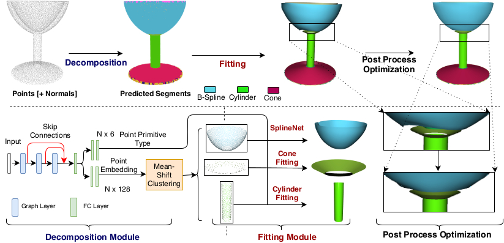
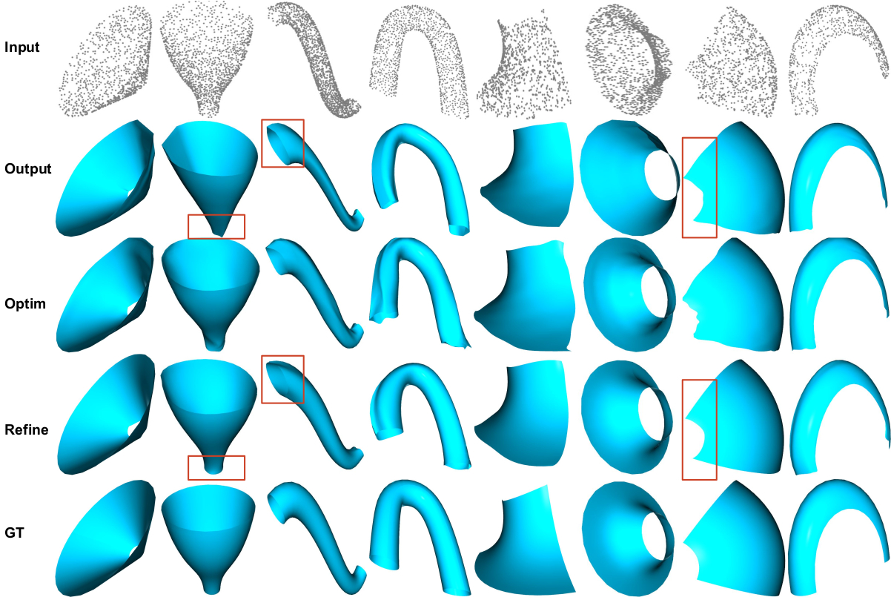
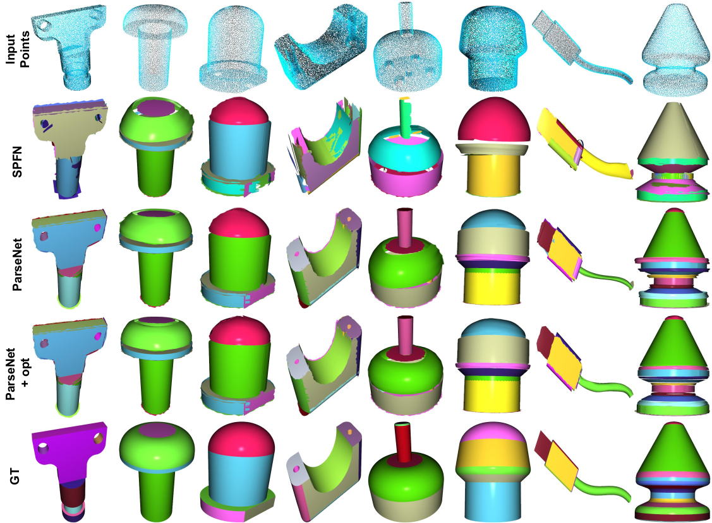

# ParSeNet: A Parametric Surface Fitting Network for 3D Point Clouds
Authors: [Gopal Sharma](https://hippogriff.github.io/), Difan Liu, Evangelos Kalogerakis, Subhransu Maji, Siddhartha Chaudhuri, Radomír Měch


## Abstract
We propose a novel, end-to-end trainable, deep network called ParSeNet that decomposes a 3D point cloud into parametric surface patches, including B-spline patches as well as basic geometric primitives. ParSeNet is trained on a large-scale dataset of man-made 3D shapes and captures high-level semantic priors for shape decomposition. It handles a much richer class of primitives than prior work, and allows us to represent surfaces with higher fidelity. It also produces repeatable and robust parametrizations of a surface compared to purely geometric approaches. We present extensive experiments to validate our approach against analytical and learning-based alternatives.


## Method


## Results
### Differentiable Spline Fitting


### Surface Fitting



## Citation
```
@misc{sharma2020parsenet,
    title={ParSeNet: A Parametric Surface Fitting Network for 3D Point Clouds},
    author={Gopal Sharma and Difan Liu and Evangelos Kalogerakis and Subhransu Maji and Siddhartha Chaudhuri and Radomír Měch},
    year={2020},
    eprint={2003.12181},
    archivePrefix={arXiv},
    primaryClass={cs.CV}
}
```
